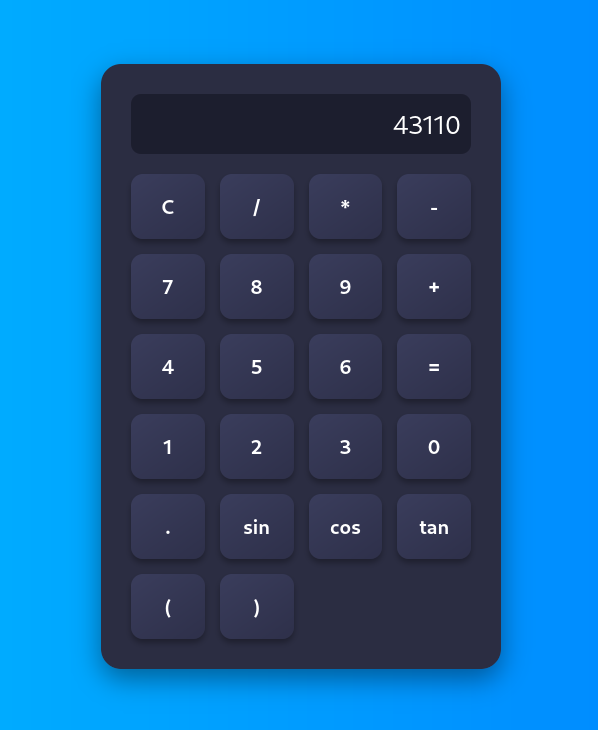

# 🧮 Scientific Calculator

A **simple yet powerful scientific calculator** built using **HTML**, **CSS**, and **JavaScript**.  
It supports basic arithmetic operations as well as trigonometric functions like **sin**, **cos**, and **tan**, all wrapped in a clean and responsive user interface.

---

## 📸 Screenshot

---

## 🚀 Features

- ➕ Addition, ➖ Subtraction, ✖️ Multiplication, ➗ Division  
- 🔢 Decimal support  
- 🧹 Clear and backspace functions  
- 📐 Trigonometric operations: **sin**, **cos**, **tan**  
- 🧮 Real-time result display  
- 🎨 Clean, modern, and responsive UI  
- 💻 Works on all major browsers and devices  

---

## 🛠️ Tech Stack

- **HTML5** – Structure and layout of the calculator  
- **CSS3** – Styling, responsiveness, and animations  
- **JavaScript (ES6)** – Core logic and trigonometric calculations  
